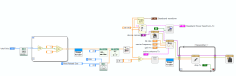
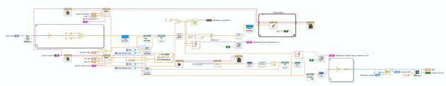
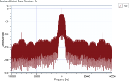
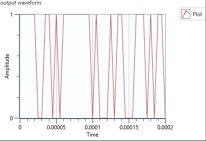
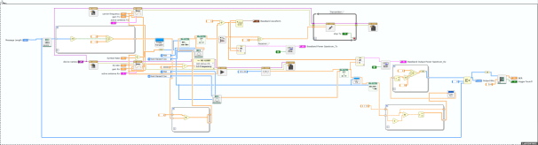
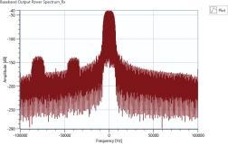
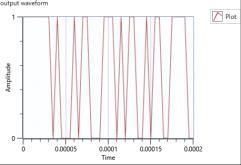
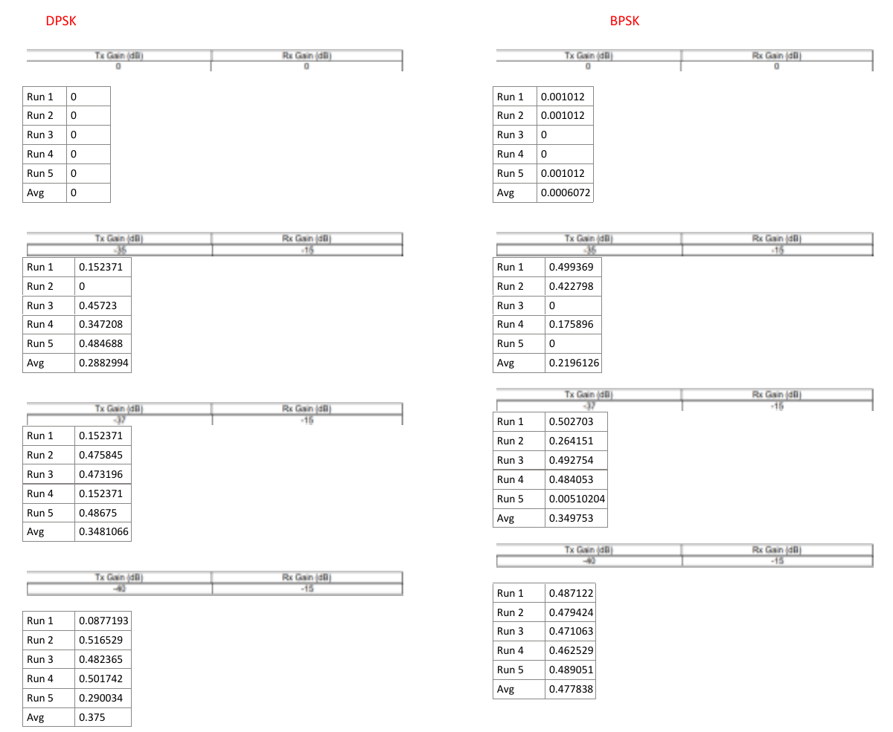

# BPSK and DPSK evidence

Selected screenshots showing BPSK and DPSK block diagrams, signal plots, and recorded BER results.

## BPSK

Transmitter block diagram:

Receiver block diagram:

Received spectrum and output waveform:

## DPSK

Receiver block diagram:

Received spectrum and output waveform:

## Recorded BER results

BPSK and DPSK measurements across transmitter gain settings:

